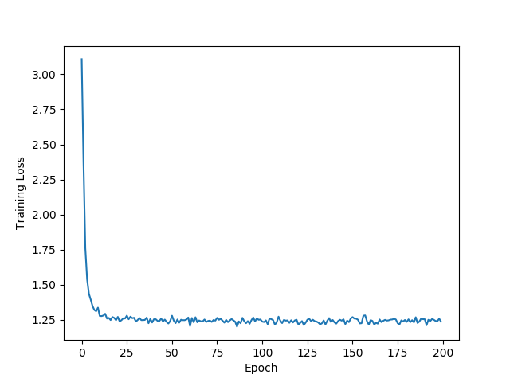
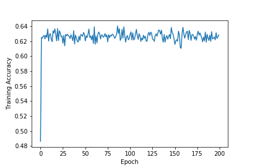
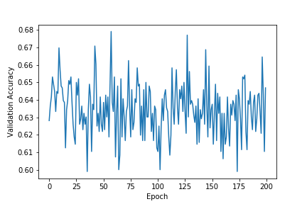

##  Hierarchical Attention Networks for Document Classification

We know that documents have a hierarchical structure, words combine to form sentences and sentences combine to form documents. We can try to learn that structure or we can input this hierarchical structure into the model and see if it improves the performance of existing models. [This paper](https://www.cs.cmu.edu/~diyiy/docs/naacl16.pdf) exploits that structure to build a classification model. 

This is a (close) implementation of the model in PyTorch. 

### Keypoints
- The network uses Bidirectional GRU to capture the contextual information about a word.
- There are two layers of attention, one Word level, and another Sentence level.
- It uses word2vec for word embeddings.
- Negative Log Likelihood is used as the loss function.
- The dataset was divided in the ratio 8:1:1 for training, validation, and test respectively.

`Note: If you are using NLLLoss from pytorch make sure to use the log_softmax function from the functional class and not softmax`

### Notebook

The notebook contains was trained on yelp dataset taken from [here](https://github.com/justmarkham/DAT7/blob/master/data/yelp.csv). 

The best accuracy that I got was around ~ 64.6%. This dataset has only 10000 samples and 29 classes. Here is the training loss for the dataset. 

Here is the training accuracy for the process.  

Here is the validation accuracy for the process.

### Attachments
 You can find the word2vec model trained on this dataset [here](dictonary_yelp) and the trained weights of the HAN model [here](sent_attn_model_yelp.pth) 
